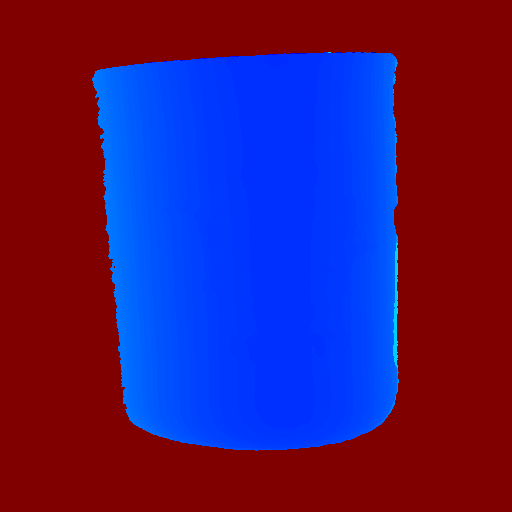
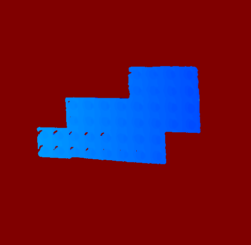

# Spacetime Stereo
Basic implementation of the spacetime stereo concept in python using ZED camera.

# Description
Spacetime stereo is 3D reconstruction  technique that enables precise estimation of the 3D geometry of an object using two or more cameras and an uncalibrated projector. This approach utilizes temporal variation of scene illumination to establish accurate matching between different cameras. As a result, spacetime stereo is capable of generating highly precise 3D reconstructions of objects and scenes.

# Requirements
 - pytorch
 - opencv
 - open3D

# Candle dataset
captured images  


estimated disparity map  


point cloud  


# Lego dataset
captured images  


estimated disparity map  


point cloud  


# Usage
Estimate object 3D geometry using spacetime stereo technique
```
python main_reconstruct.py
```

Show results
```
python main_show_model.py
```

# TODO
- add disparity estimation with sup-pixel accuracy


# References 
- Spacetime Stereo: A Unifying Framework for Depth from Triangulation.  
  James Davis, Ravi Ramamoothi, Szymon Rusinkiewicz.   
Computer Vision and Pattern Recognition (CVPR), 2003  
https://graphics.stanford.edu/papers/SpacetimeStereo/
